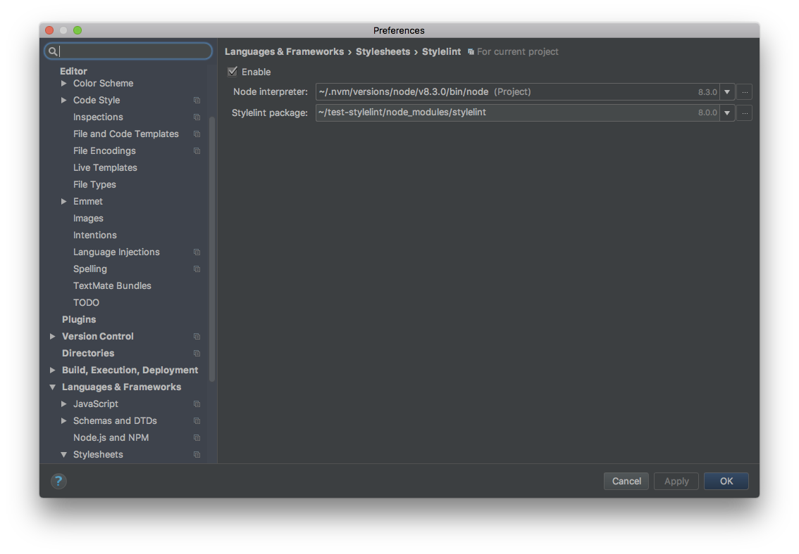

# Styleguides
Simple guidelines and text-editor/ide configuration files shared across projects

### OW Main Styleguides
- [FD Dev Living Styleguides](frontend-styleguides.md)
- [ITCSS](https://speakerdeck.com/dafed/managing-css-projects-with-itcss)

### In depth documentation for BEM
- [BEM](https://en.bem.info/methodology/quick-start/)

### Git global **gitignore** configuration
- [.global_gitignore](https://raw.githubusercontent.com/Objectway/styleguides/master/.gitignore_global)

### Mandatory linters
- [EditorConfig](http://editorconfig.org)
- [Stylelint](https://github.com/stylelint/stylelint)
  - [Stylelint Order](https://github.com/hudochenkov/stylelint-order)
  - [Stulelint Scss](https://github.com/kristerkari/stylelint-scss)

### Nice to have linters
- [Puglint](https://github.com/pugjs/pug-lint)

### Deprecated linters
- [Sasslint](https://www.npmjs.com/package/sass-lint) *(deprecated)*
- [Scsslint](https://github.com/brigade/scss-lint) *(deprecated)*

### Linters configuration files
- [EditorConfig](.editorconfig)
- [Puglint](.pug-lintrc)
- [Stylelint](.stylelintrc)

### Deprecated linters configuration files
- [Sasslint](.sass-lint.yml) *(deprecated)*
- [Scsslint](.scss-lint.yml) *(deprecated)*

### StyleLint in depth installation guide
- [Stylelint installation step by step](stylelint-installation.md)

### Atomic Design documentation
- [Atomic Design Methodology](http://atomicdesign.bradfrost.com/chapter-2/)

## Stylelint installation

Depending on your editor you can install **Stylelint** locally on your project or globally ( most of the times globally will work with every editor), **Stylelint plugins** need to be installed **LOCALLY** on your project.

#### Remember to use `--save-dev` in your npm installation if you want to save those packages as dependencies in your project!

### Webstorm configuration

In your project root folder

`$ npm install stylelint styleint-order stylelint-scss` than configure the **Stylelint package** configuration with the local installation:

### Visual Studio Code

`$ npm install -g stylelint-order`

`$ npm install stylelint-order stylelint-scss`
